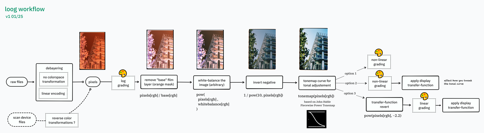

# loog

`loog` is my personal workflow for digitaly developing film negatives.

"loog-dev" is a gizmo(plugin) which allow to use that workflow in Foundry Nuke
software.

## installation

This is a usual nuke node with no dependencies, you can just copy the content
of [loog-developer.nk](loog-developer.nk) and paste it in a Nuke scene.

## workflow

Loog works with camera raw file as input. This is because we need to ensure
no color-transformation is applied on the data captured by the camera.
(loog could also work on non-raw file but might produce less consistent result)

Workflow is described as :

1. debayer camera raw file to an untransformed linear encoding
2. remove base film layer by sampling the negative
3. white balance the image to adjust color rendition
4. invert the negative by converting density to transmittance
5. apply a 1D "S-shaped" curve transform with user-control to adjust intended
   exposure

An optional step include applying the camera color matrix just before 5. but it
has not be proved to produce visually pleasing result.

Even if there is no colorspace transformation along the process, the output is
assumed to be sRGB and work nicely as such. 

This workflow offer creative color during 3. and 5., where 3. allow you to
adjust the color feel of your picture (ex: warmer, colder) while 5. adjust the
contrast and the brightness perception.

## reference

- The 1D curve is a node made by Jed
  Smith: https://github.com/jedypod/nuke-colortools/blob/master/toolsets/transfer_function/Tonemap_PiecewisePower.nk
  which is itself based on a formula by John Hable.